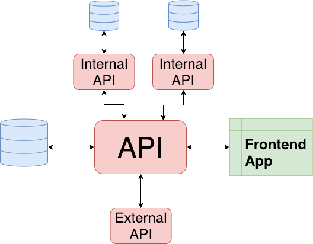
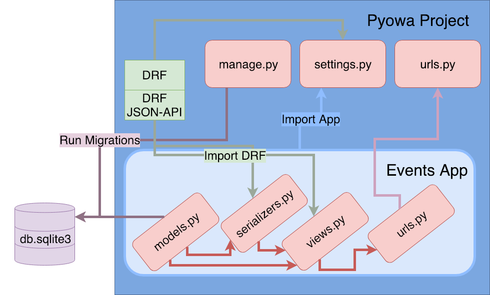

# Django Rest Framework
### A Tutorial Presentation Prepared for Pyowa
#### 2.5.19

APIs are commonplace means through which data can be systematically shared from one place to another.

This is a simplified view of how APIs are often used - to connect a database (or some other data source) to a user or consumer:


Some of may may have even built APIs to talk to other APIs or APIs for your frontend to consume, to allow the end user to interact with the data. This figure gives a more complex example of a microservices architecture:



In this tutorial, we'll build an API from the ground up using Django and Django Rest Framework (DRF). We will take our time getting started and write out our serializers and views by hand. Then we will use DRF's class views and serializers to help keep our code clean and simple, while building a robust, user interactive API.

This diagram shows the layout of the django project we will create. I recommend you reference this at each commit while going through the tutorial:



_Note_: Each subheading below references a commit on this branch. Use it as a reference if needed. This commit will show you what occured during this section.

## [Create Django Project](https://github.com/mbeche/pyowa-drf-demo/commit/680a2605da6fee4c9d797ea8325d5d1cd04f349b)

Create virtual environment and install Django and DRF

``` python
pip install django
pip install djangorestframework
```

The exact versions I'm installing for this tutorial:

```python
`Django==2.1.5`
djangorestframework==3.9.1
```

Start a django project:
```python
django-admin startproject pyowa .
```
The dot at the end of the command tells django to start the project in the current folder. If you do not put the dot it will create a new folder for you.

You will have a file structure that looks like this:
```
▾ pyowa/
  - __init__.py
  - settings.py
  - urls.py
  - wsgi.py
- manage.py
```

*commit* & update diragram .. questions?

## [Create Event App](https://github.com/mbeche/pyowa-drf-demo/commit/413eafa2e66e47f78b14109b9ea3874dca2550e6)
Now we will use Django to create an app for events for Pyowa:

`python manage.py startapp events`

This is the preferred nomenclature for Djagno: a single project with multiple apps. The idea behind this is that apps can be created modularly and used in a plug-and-play fashion projects.

Your new file structure should look like:
```
▾ events/
  ▸ migrations/
  - __init__.py
  - admin.py
  - apps.py
  - models.py
  - tests.py
  - views.py
▾ pyowa/
  - __init__.py
  - settings.py
  - urls.py
  - wsgi.py
- manage.py
```

You'll notice additional files in the events app. Before we dive in there, we need to make sure our project is aware of the new application you created and Django Rest Framework.

*commit* .. questions?

## [Add Events and Rest Framework Project](https://github.com/mbeche/pyowa-drf-demo/commit/626483a15e929287b22a453446e61b724f55e34c)
Navigate to `settings.py` in the `pyowa` directory and find the `INSTALLED_APPS` section and add `events` and `rest_framework`.

```python
INSTALLED_APPS = [
    'django.contrib.admin',
    'django.contrib.auth',
    'django.contrib.contenttypes',
    'django.contrib.sessions',
    'django.contrib.messages',
    'django.contrib.staticfiles',
    'events',
    'rest_framework',
]
```

*commit* & update diragram .. questions?

## [Add Event model to the Events App](https://github.com/mbeche/pyowa-drf-demo/commit/3fdf4b556b6e979770736c65227ba0e3d776b4a6)
Django follows the Model View Controller architecture. However for this API driven tutorial, we will be focusing on the model (known as `model` in django) and controller (ironically named `view` in django).

Let's start with the model in the events app. We will want to have fields for `title`, `presenter`, `time`, `location`, `coordinator`, and `description`. Django comes baked in with fields, some have required parameters. For more information visit [Django Documentation](https://docs.djangoproject.com/en/2.1/ref/models/fields/)

In `models.py` we will create a single class `Event` which inherits from django's `models.model`:

``` python
from django.db import models
from django.utils.timezone import now


class Event(models.Model):
    title = models.CharField(max_length=256)
    presenter = models.CharField(max_length=256, blank=True)
    time = models.DateTimeField(default=now)
    location = models.CharField(max_length=256, blank=True)
    coordinator = models.CharField(max_length=256, blank=True)
    description = models.TextField(blank=True)
```

Now we need to makemigrations and migrate our database to reflect this model change:

``` python
python manage.py makemigrations
python manage.py migrate
```

Let's take a look at what we created by using the python shell by running `python manage.py shell`. This is the basic python shell you would get by running `python` but`manage.py` sets the `DJANGO_SETTINGS_MODULE` variable, which gives Django the Python import path to your `pyowa/settings.py` file.

Once inside the shell, we can explore the model and creating instances:

```python
>>> from events.models import Event # import the model that we've created
>>> Event.objects.all() # objects is the manager for the model. Here we see we have no instances
      <QuerySet []>
>>> Event.objects.create() # create an object
      <Event: Event object (1)>
>>> Event.objects.all() # confirm object is created
      <QuerySet [<Event: Event object (1)>]>
>>> Event.objects.get(id=1) # get first object
      <Event: Event object (1)>
>>> event1 = Event.objects.get(id=1) # assign instance to variable to we can edit itt
>>> event1.id # access id
      1
>>> event1.title # title is blank
      ''
>>> event1.time # event time defaults to creation time
      datetime.datetime(2019, 1, 30, 22, 11, 57, 487525, tzinfo=<UTC>)
>>> event1.title = 'API Driven Design with Django Rest Framework' # set the title
>>> event1.presenter = 'Michael Johnson' # set the presenter
>>> event1.location = 'LenderClose' # set the location
>>> event1.save() # save the event
>>> Event.objects.get(id=1).title # make sure changes persisted
      'API Driven Design with Django Rest Framework'
>>> Event.objects.create() # create instance 2
      <Event: Event object (2)>
>>> Event.objects.create() # create instance 3
      <Event: Event object (3)>
>>> Event.objects.all() # check that there are three objects
      <QuerySet [<Event: Event object (1)>, <Event: Event object (2)>, <Event: Event object (3)>]>
>>> Event.objects.filter(title='') # two events have blank title
      <QuerySet [<Event: Event object (2)>, <Event: Event object (3)>]>
>>> Event.objects.filter(title='API Driven Design with Django Rest Framework') # one event has the persisted title
      <QuerySet [<Event: Event object (1)>]>
```

*commit* & update diragram .. questions?

## [Make serializer for Event model](https://github.com/mbeche/pyowa-drf-demo/commit/2624e5ce293b2ac4833d512b8e4b61abdb2ee063)
In order to route up our model for API consumption, we need to create a serializer to serailize and deserialize our event instances. Create a new file `serializers.py` in our `events` app:

```python
from rest_framework import serializers
from events.models import Event

class EventSerializer(serializers.Serializer):
    id = serializers.IntegerField(read_only=True)
    title = serializers.CharField(max_length=256)
    presenter = serializers.CharField(required=False, allow_blank=True, max_length=256)
    time = serializers.DateTimeField()
    location = serializers.CharField(required=False, allow_blank=True, max_length=256)
    coordinator = serializers.CharField(required=False, allow_blank=True, max_length=256)
    description = serializers.CharField(required=False, allow_blank=True, max_length=256)

    def create(self, validated_data):
        """
        Create and return a new `Event` instance, given the validated data.
        """
        return Event.objects.create(**validated_data)

    def update(self, instance, validated_data):
        """
        Update and return an existing `Event` instance, given the validated data.
        """
        instance.title = validated_data.get('title', instance.title)
        instance.presenter = validated_data.get('presenter', instance.presenter)
        instance.time = validated_data.get('time', instance.time)
        instance.location = validated_data.get('location', instance.location)
        instance.coordinator = validated_data.get('coordinator', instance.coordinator)
        instance.description = validated_data.get('description', instance.description)
        instance.save()
        return instance
```

Similar to how we used the django shell to investigate our model to create an instance of our model `Event`, we can use it to seralize it into a python native datatype. We can then further use the DRF class `JSONRenderer` to render our dictionary as JSON:

```python
>>> from events.models import Event # import our model
>>> from events.serializers import EventSerializer # import our serializer
>>> from rest_framework.renderers import JSONRenderer # import the class that will render to JSON
>>> events = Event.objects.all()
>>> events # confirm we still have data in the DB - otherwise make new ones
      <QuerySet [<Event: Event object (1)>, <Event: Event object (2)>, <Event: Event object (3)>]>
>>> event1 = events[0] # store first event as variable
>>> print(event1) # event1 is a model object/instance
      Event object (1)
>>> event1.title # access event1 title as model instance
      'API Driven Design with Django Rest Framework'
>>> serializer1 = EventSerializer(event1) # serialize event1 to python native datatype
>>> print(serializer1)
      EventSerializer(<Event: Event object (1)>):
         id = IntegerField(read_only=True)
         title = CharField(max_length=256)
         presenter = CharField(allow_blank=True, max_length=256, required=False)
         time = DateTimeField()
         location = CharField(allow_blank=True, max_length=256, required=False)
         coordinator = CharField(allow_blank=True, max_length=256, required=False)
         description = CharField(allow_blank=True, max_length=256, required=False)
>>> print(serializer1.data) # serializer.data contains a dictionary with object data
      {'id': 1, 'title': 'API Driven Design with Django Rest Framework', 'presenter': 'Michael Johnson', 'time': '2019-01-30T22:11:57.487525Z', 'location': '', 'coordinator': '', 'description': ''}
>>> print(serializer1.data['title']) # access the title like you would a dictionary
      API Driven Design with Django Rest Framework
>>> content = JSONRenderer().render(serializer1.data) # render the data as JSON
>>> print(content) # print JSON as bytes
      b'{"id":1,"title":"API Driven Design with Django Rest Framework","presenter":"Michael Johnson","time":"2019-01-30T22:11:57.487525Z","location":"","coordinator":"","description":""}'
>>> print(content.decode("utf-8")) # can convert bytes to string
      {"id":1,"title":"API Driven Design with Django Rest Framework","presenter":"Michael Johnson","time":"2019-01-30T22:11:57.487525Z","location":"","coordinator":"","description":""}
>>> type(content.decode("utf-8"))
      <class 'str'>
```

A similar process can be followed to deserialize this back into a model instance. For more information on this visit the [DRF Tutorial](https://www.django-rest-framework.org/tutorial/1-serialization/).

*commit* & update diragram .. questions?

## [Simplify Serializer with ModelSerializer Class](https://github.com/mbeche/pyowa-drf-demo/commit/04f6e8f90ae9be87bf9c212cec2dfb7c15dda0a0)
Some of the power behind DRF is that instead of needing to write out the complete serializer like we did above, we can use the `ModelSerializer` class to do the same thing. In `serializers.py` we can remove the serializer we wrote to be:

```python
>>> from events.models import Event
>>> from events.serializers import EventSerializer
>>> from rest_framework.renderers import JSONRenderer
>>> events = Event.objects.all()
>>> serializer = EventSerializer(events[0])
>>> print(serializer.data)
{'id': 1, 'title': 'API Driven Design with Django Rest Framework', 'presenter': 'Michael Johnson', 'time': '2019-01-30T22:11:57.487525Z', 'location': '', 'coordinator': '', 'description': ''}
```

*commit* & update diragram .. questions?

## [Create Views and URLs](https://github.com/mbeche/pyowa-drf-demo/commit/4da4a5b9832061c0fcf387303d21f67635cb5321)
Similar to how DRF simplifies the serialization process, it also simplifies the django views we will use to externally interact with the serializer. To begin, we will take it long form and then show how DRF simplifies the process. In the `events/views.py` file add the following:

```python
from django.http import HttpResponse, JsonResponse
from django.views.decorators.csrf import csrf_exempt
from rest_framework.renderers import JSONRenderer
from rest_framework.parsers import JSONParser
from events.models import Event
from events.serializers import EventSerializer
```

We will create a view that will allow us to get all the events and create a new event:

```python
@csrf_exempt
def event_list(request):
    """
    List all code events, or create a new event.
    """
    if request.method == 'GET':
        events = Event.objects.all()
        serializer = EventSerializer(events, many=True)
        return JsonResponse(serializer.data, safe=False)

    elif request.method == 'POST':
        data = JSONParser().parse(request)
        serializer = EventSerializer(data=data)
        if serializer.is_valid():
            serializer.save()
            return JsonResponse(serializer.data, status=201)
        return JsonResponse(serializer.errors, status=400)
```

We will also create a view that will allow us to retrieve, update and delete a single event:

```python
@csrf_exempt
def event_detail(request, pk):
    """
    Retrieve, update or delete a code event.
    """
    try:
        event = Event.objects.get(pk=pk)
    except Event.DoesNotExist:
        return HttpResponse(status=404)

    if request.method == 'GET':
        serializer = EventSerializer(event)
        return JsonResponse(serializer.data)

    elif request.method == 'PUT':
        data = JSONParser().parse(request)
        serializer = EventSerializer(event, data=data)
        if serializer.is_valid():
            serializer.save()
            return JsonResponse(serializer.data)
        return JsonResponse(serializer.errors, status=400)

    elif request.method == 'DELETE':
        event.delete()
        return HttpResponse(status=204)
```

Finally, to access these views, we need to connect them to URLs. First we will connect our `events` app to URLs.

Create the file `events/urls.py`:

```python
from django.urls import path
from events import views

urlpatterns = [
    path('events/', views.event_list),
    path('events/<int:pk>/', views.event_detail),
]
```

Then we need to connect our `events` app URLs to the `pyowa` project's root urlconf.

In the file `pyowa/urls.py`:

```python
from django.urls import path, include

urlpatterns = [
    path('', include('events.urls')),
]
```

Now let's spin up our server and check out our API:

`python manage.py runserver`

Then navigate your browser to [your local host (likely http://127.0.0.1:8000/)](http://127.0.0.1:8000/)

You'll notice an error message that says that you have not set up this page yet. However django gives you hinds and reminds us that we setup two urls in our URLconf:
- Events List: [{base url}/events/](http://127.0.0.1:8000/events/)
- Events Detail: [{base url}/events/<int:pk>](http://127.0.0.1:8000/events/1)

Here `<int:pk>` is the `integer primiary key` of our model objects. In our case: 1, 2, 3.

The data you get back from both URLs isn't that exciting, but it's JSON consumable by the user! However this is just the beginning of what DRF offers.

*commit* & update diragram .. questions?

## [Using APIView Class](https://github.com/mbeche/pyowa-drf-demo/commit/b79f3e16ae6c1e3c709d4ac6699c4108ab4fd63a)

While DRF has decorators that help simplify our view (see the [DRF Tutorial](https://www.django-rest-framework.org/tutorial/2-requests-and-responses/) for more on this), we are going to jump straight to class based views to show how we can use DRF to write our views.

We will start by implementing the `APIView` class in our `events/views.py` file:

```python
from events.models import Event
from events.serializers import EventSerializer
from django.http import Http404
from rest_framework.views import APIView
from rest_framework.response import Response
from rest_framework import status


class EventList(APIView):
    """
    List all events, or create a new event.
    """
    def get(self, request, format=None):
        events = Event.objects.all()
        serializer = EventSerializer(events, many=True)
        return Response(serializer.data)

    def post(self, request, format=None):
        serializer = EventSerializer(data=request.data)
        if serializer.is_valid():
            serializer.save()
            return Response(serializer.data, status=status.HTTP_201_CREATED)
        return Response(serializer.errors, status=status.HTTP_400_BAD_REQUEST)

class EventDetail(APIView):
    """
    Retrieve, update or delete a event instance.
    """
    def get_object(self, pk):
        try:
            return Event.objects.get(pk=pk)
        except Event.DoesNotExist:
            raise Http404

    def get(self, request, pk, format=None):
        event = self.get_object(pk)
        serializer = EventSerializer(event)
        return Response(serializer.data)

    def put(self, request, pk, format=None):
        event = self.get_object(pk)
        serializer = EventSerializer(event, data=request.data)
        if serializer.is_valid():
            serializer.save()
            return Response(serializer.data)
        return Response(serializer.errors, status=status.HTTP_400_BAD_REQUEST)

    def delete(self, request, pk, format=None):
        event = self.get_object(pk)
        event.delete()
        return Response(status=status.HTTP_204_NO_CONTENT)
```

We will also need to refactor our `events/urls.py` to use our class base views:

```python
from django.urls import path
from rest_framework.urlpatterns import format_suffix_patterns
from events import views

urlpatterns = [
    path('events/', views.EventList.as_view()),
    path('events/<int:pk>/', views.EventDetail.as_view()),
]

urlpatterns = format_suffix_patterns(urlpatterns)
```

Let's go ahead and spin up our development server with `python manage.py runserver` and check out [your local host](http://127.0.0.1:8000/). You'll notice you have a sweet new [Browsable API](https://www.django-rest-framework.org/topics/browsable-api/). Here you can see the data formatted, post and put to your API.

*commit* & update diragram .. questions?

## [Replace View Functionality with DRF Mixins](https://github.com/mbeche/pyowa-drf-demo/commit/3f3b22a8d9fa9cc90df94b4950a3a97d76b43f11)

One benefit to to using a class-based view is that we can used DRF mixins to substitude for behavior. First, we will be switching from `APIView` to the slightly extended `GenericAPIView`. Then we will use the following mixings:
- `ListModelMixin` provides `.list()` that we will bind to `get` in our `EventList` view
- `CreateModelMixin` provides `.create()` that we will bind to `post` in our `EventList` view
- `RetrieveModelMixin` provides `.retrieve()` that we will bind to `get` in our `EventDetail` view
- `UpdateModelMixin` provides `.update()` that we will bind to `put` in our `EventDetail` view
- `DestroyModelMixin` provides `.destroy()` that we will bind to `delete` in our `EventDetail` view

So, let's update our `events/views.py`:

```python
from events.models import Event
from events.serializers import EventSerializer
from rest_framework import mixins
from rest_framework import generics

class EventList(mixins.ListModelMixin,
                  mixins.CreateModelMixin,
                  generics.GenericAPIView):
    queryset = Event.objects.all()
    serializer_class = EventSerializer

    def get(self, request, *args, **kwargs):
        return self.list(request, *args, **kwargs)

    def post(self, request, *args, **kwargs):
        return self.create(request, *args, **kwargs)

class EventDetail(mixins.RetrieveModelMixin,
                    mixins.UpdateModelMixin,
                    mixins.DestroyModelMixin,
                    generics.GenericAPIView):
    queryset = Event.objects.all()
    serializer_class = EventSerializer

    def get(self, request, *args, **kwargs):
        return self.retrieve(request, *args, **kwargs)

    def put(self, request, *args, **kwargs):
        return self.update(request, *args, **kwargs)

    def delete(self, request, *args, **kwargs):
        return self.destroy(request, *args, **kwargs)
```

As you can see, everything on the API works the same as it did with the `APIView` ecxept now we can use the mixins to offer the CRUD and error handling functionality.


*commit* & update diragram .. questions?

## [Replace Mixins with Concrete View Classes](https://github.com/mbeche/pyowa-drf-demo/commit/5dda700b5f9d96ece975be4efe29f43204c03298)
DRF has created other class views for normal API functionality, including the functionality we use above. Instead of using:
- `ListModelMixin`, `CreateModelMixin`, and `GenericAPIView` we can use `ListCreateAPIView`
- `RetrieveModelMixin`, `UpdateModelMixin`, `DestroyModelMixin` and `GenericAPIView` we can used `RetrieveUpdateDestroyAPIView`

Our `views.py` file will now be simplified to using those two views after assigning the model:

```python
from events.models import Event
from events.serializers import EventSerializer
from rest_framework import generics


class EventList(generics.ListCreateAPIView):
    queryset = Event.objects.all()
    serializer_class = EventSerializer


class EventDetail(generics.RetrieveUpdateDestroyAPIView):
    queryset = Event.objects.all()
    serializer_class = EventSerializer
```

You'll see that your API is functioning the same way that it was before we replaced the mixins with the concrete views. There are others for a variety of API views that could be required available in the [DRF Documentation](https://www.django-rest-framework.org/api-guide/generic-views/#concrete-view-classes)

*commit* & update diragram .. questions?

## [Add User Model for Coordinator](https://github.com/mbeche/pyowa-drf-demo/commit/5096b633a387de53fac4e78a08dfbfd143d3d3e3)
Next we'll use DRF to hook up the native Django user model to the coordinator field. In the `events/models.py` change the following:

```python
class Event(models.Model):
    title = models.CharField(max_length=256)
    presenter = models.CharField(max_length=256, blank=True)
    time = models.DateTimeField(default=datetime.now(tz=timezone.utc))
    location = models.CharField(max_length=256, blank=True)
    coordinator = models.ForeignKey('auth.User', related_name='events', null=True, on_delete=models.SET_NULL) # this line is different!
    description = models.TextField(blank=True)
```

Because we changed a model, we will need to run migrations to change our database. Do this by running the following commands:

`python manage.py makemigrations`
`python manage.py migrate`

Navigate to your API list view and look at the POST block at the bottom. Try to create an event with a coordinator and you'll notice that the coordinator field is now an empty drop down! This is because it is tied to the django user model and there are no django users. Let's create a django user:

`python manage.py createsuperuser`

The only required fields are username and password. Once you create a superuser, refresh your API in the browser, and you should find the user in the dropdown. Sweet!

Next we will create add to `serializers.py` for the user model:

```python
from django.contrib.auth.models import User

class UserSerializer(serializers.ModelSerializer):
    events = serializers.PrimaryKeyRelatedField(many=True, queryset=Event.objects.all())

    class Meta:
        model = User
        fields = ('id', 'username', 'events')
```

Next we will need to create our views for the user model in `views.py`:

```python
from django.contrib.auth.models import User


class UserList(generics.ListAPIView):
    queryset = User.objects.all()
    serializer_class = UserSerializer


class UserDetail(generics.RetrieveAPIView):
    queryset = User.objects.all()
    serializer_class = UserSerializer
```

Finally we need to add our user model API to `events/urls.py`. Do so by adding the following in the URLconf:

```python
path('users/', views.UserList.as_view()),
path('users/<int:pk>/', views.UserDetail.as_view()),
```

*commit* & update diragram .. questions?

## [Add Root API and Add Links to API for Browsability](https://github.com/mbeche/pyowa-drf-demo/commit/67be2d3c4a06496dc1be9d9a06c953f4d3a20ec7)

Create a root endpoint for our API. Add the following to your `events/views.py` file:

```python
from rest_framework.decorators import api_view
from rest_framework.response import Response
from rest_framework.reverse import reverse


@api_view(['GET'])
def api_root(request, format=None):
    return Response({
        'users': reverse('user-list', request=request, format=format),
        'events': reverse('event-list', request=request, format=format)
    })
```

To perform the `reverse lookups` that are done on `user-list` and `event-list`, we need to add these names to the URLconf. We also need to create a URLconf for the root API. Change `events/urls.py` to look like the following::

```python
path('events/', views.EventList.as_view(), name='event-list'),
path('events/<int:pk>/', views.EventDetail.as_view(), name='event-detail'),
path('users/', views.UserList.as_view(), name='user-list'),
path('users/<int:pk>/', views.UserDetail.as_view(), name='user-detail'),
path('', views.api_root),
```

DRF also allows for us to use links in our serializer to detail views, as well as related fields. To enable this, we change `ModelSerializer` to `HyperlinkedModelSerializer`. We also will change `PrimaryKeyRelatedField` to `HyperlinkedRelatedField`. We do this in `serializers.py`:

```python
class UserSerializer(serializers.HyperlinkedModelSerializer):
    events = serializers.HyperlinkedRelatedField(many=True, view_name='event-detail', read_only=True)
    class Meta:
        model = User
        fields = ('url', 'id', 'username', 'events')

class EventSerializer(serializers.HyperlinkedModelSerializer):
    class Meta:
        model = Event
        fields = ('url', 'id', 'title', 'presenter', 'time', 'location', 'coordinator', 'description')
```

Now our API has a root with URLs to each model serialized. The list views and detail views also contain links to related fields.

*commit* & update diragram .. questions?

## [Install Django Rest Framework JSON-API](https://github.com/mbeche/pyowa-drf-demo/commit/5096b633a387de53fac4e78a08dfbfd143d3d3e3)

One way we have found to improve on DRF is to use [Django Rest Framework JSON-API](https://django-rest-framework-json-api.readthedocs.io/). This creates a structure to our data as follows:

```json
{
    "data": {
        "type": "Event",
        "id": "1",
        "attributes": { "all the fields" },
        "relationships": {
            "related-data": {
                "data": {
                    "type": "User",
                    "id": "1"
                }
            }
        }
    },
    "included": [ "Expanded data of related" ]
}
```

This structure provides consistency of data no matter what the type or number of fields. It also allows for all related data to be included if the serializer or URL asks for it.

To install DRF JSON-API install with pip:
`pip install djangorestframework-jsonapi`

Then in `settings.py` add to `INSTALLED_APPS` and past the following code to override DRF with DRF JSON-API:

```python
INSTALLED_APPS = [
    'django.contrib.admin',
    'django.contrib.auth',
    'django.contrib.contenttypes',
    'django.contrib.sessions',
    'django.contrib.messages',
    'django.contrib.staticfiles',
    'events',
    'rest_framework',
    'rest_framework_json_api',
]

REST_FRAMEWORK = {
    'PAGE_SIZE': 10,
    'EXCEPTION_HANDLER': 'rest_framework_json_api.exceptions.exception_handler',
    'DEFAULT_PAGINATION_CLASS':
        'rest_framework_json_api.pagination.JsonApiPageNumberPagination',
    'DEFAULT_PARSER_CLASSES': (
        'rest_framework_json_api.parsers.JSONParser',
        'rest_framework.parsers.FormParser',
        'rest_framework.parsers.MultiPartParser'
    ),
    'DEFAULT_RENDERER_CLASSES': (
        'rest_framework_json_api.renderers.JSONRenderer',
        # If you're performance testing, you will want to use the browseable API
        # without forms, as the forms can generate their own queries.
        # If performance testing, enable:
        # 'example.utils.BrowsableAPIRendererWithoutForms',
        # Otherwise, to play around with the browseable API, enable:
        'rest_framework.renderers.BrowsableAPIRenderer'
    ),
    'DEFAULT_METADATA_CLASS': 'rest_framework_json_api.metadata.JSONAPIMetadata',
    'DEFAULT_FILTER_BACKENDS': (
        'rest_framework_json_api.filters.QueryParameterValidationFilter',
        'rest_framework_json_api.filters.OrderingFilter',
        'rest_framework_json_api.django_filters.DjangoFilterBackend',
        'rest_framework.filters.SearchFilter',
    ),
    'SEARCH_PARAM': 'filter[search]',
    'TEST_REQUEST_RENDERER_CLASSES': (
        'rest_framework_json_api.renderers.JSONRenderer',
    ),
    'TEST_REQUEST_DEFAULT_FORMAT': 'vnd.api+json'
}
```

Lastly, we will aslo include all the `user` data in our event list by adding `included_resources` which informs DJA of what you would like to include and `included_serializers` which tells DJA how you want to include it:

```python
class EventSerializer(serializers.HyperlinkedModelSerializer):
    included_serializers = {
        'coordinator': UserSerializer,
    }
    class Meta:
        model = Event
        fields = ('url', 'id', 'title', 'presenter', 'time', 'location', 'coordinator', 'description')

    class JSONAPIMeta:
        included_resources = ['coordinator']
```

Now when we view our data we will see this altered structure. Also, when we checkout the `event details` we will see all the user data included in the `included` section. This means that we can get all the data we need related to a dataset with just one API call. Another reason we use JSON API is because it integrates seamlessly with the Ember Data. We do not need to worry about the structure of our JSON, Ember Data and Django with DRF JSON API talk with each other and we can use ember models populated with data without the need for serialization on the frontend.


